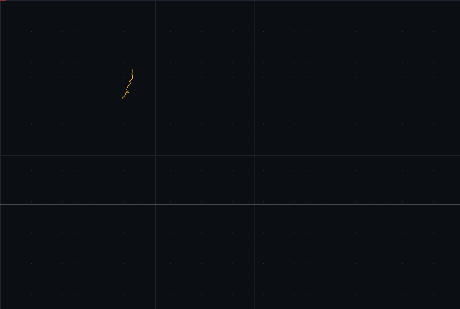
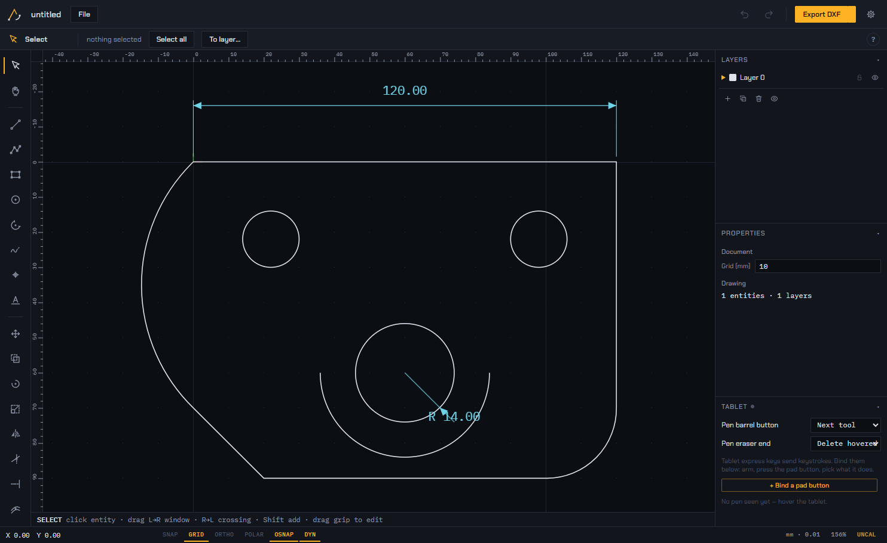
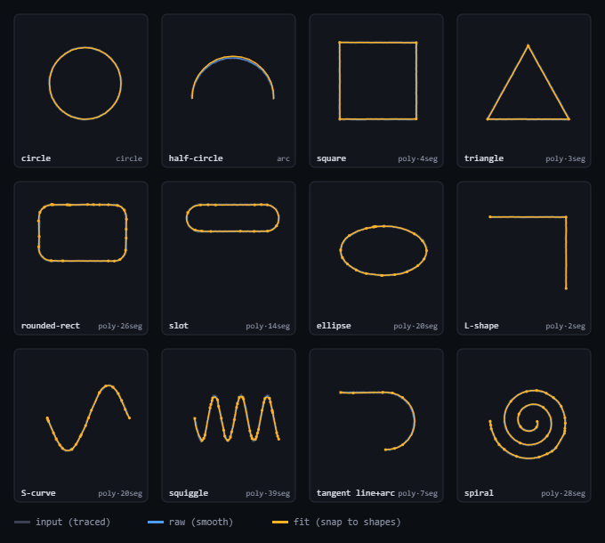
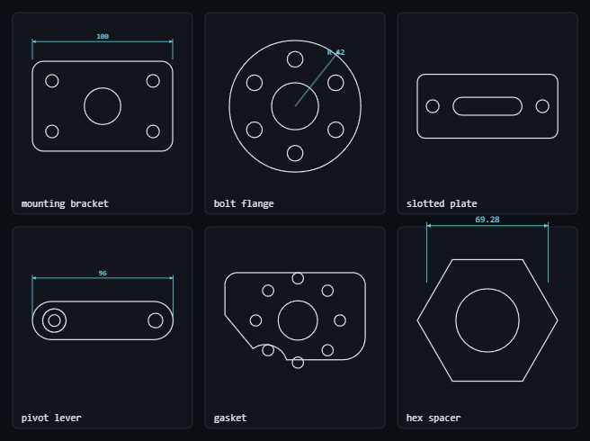

# TrueLine

**Trace physical objects with a pen tablet and export dimensionally-accurate DXF / SVG / PDF.**
A free, open-source, offline desktop alternative to the $1,500 Logic Trace digitizing system —
for CNC, CAD, and pattern making.



Sketch a rough circle and it becomes a perfect one. Trace an outline and it snaps to clean
lines, arcs, and smooth curves — then exports as true-to-size DXF your CAM software reads
directly.

### [⬇ Download TrueLine for Windows](https://github.com/Nik-Horner/TrueLine/releases/latest)

[](https://github.com/Nik-Horner/TrueLine/releases/latest)
&nbsp;
[](LICENSE)

Click the button, then download **`TrueLine-Setup.exe`** from the latest release. Run it — no
account, no internet, no license.

> First launch, Windows SmartScreen may show a blue "Windows protected your PC" box because the
> app isn't code-signed with a paid certificate. Click **More info → Run anyway**. That's normal
> for free/indie apps — it's not a virus warning, just an unrecognized publisher.

The app **updates itself**: when a new release is published here, installed copies download it in
the background and install it on the next launch.

---

## What it does



Lay a part, template, or pattern on your tablet (or import a photo), trace the outline with the
pen, clean it up, set the scale from one known measurement, and export. The traced geometry
becomes real millimeters, so the DXF drops straight into Fusion, AutoCAD, LibreCAD, plasma/laser
CAM, or apparel software.

### Tracing that snaps to shapes



Draw rough; get clean. Circles snap to perfect circles, arcs to arcs, straight edges to straight
lines, and freeform curves become smooth tangent-continuous arc chains — not jagged facets.
Prefer a faithful smooth outline? Switch the trace mode to **Raw** for a tremor-cleaned polyline.

### Real parts, real dimensions



Brackets, flanges, gaskets, slots, bolt circles, hex profiles — traced or drawn with holes,
fillets, arcs, and dimensions, exported as true-scale DXF for the shop.

## Features

- **Draw:** line, polyline, rectangle, circle (center-R / 2-point / **3-point**), arc
  (**3-point** / center-start-end), point, text, freehand **trace** with shape-fitting.
- **Modify:** move, copy, rotate, scale (incl. scale-by-reference), mirror, trim, extend, offset,
  fillet, chamfer, grip editing.
- **Measure & annotate:** distance, angle, area & perimeter; linear / aligned / radial dimensions.
- **Snapping:** endpoint, midpoint, center, quadrant, intersection, perpendicular; ortho, polar, grid.
- **Layers** with color, line type, lock, and hide. **Units** mm / cm / inch with precision.
- **Pen-tablet first:** set true scale from any known dimension, bind the pen barrel button and
  tablet express keys, touch pinch-zoom/pan.
- **Editable hotkeys** — rebind any tool to a keyboard key *or* a tablet pad button.
- **Files:** DXF R12 out *and* in, SVG (true mm), 1:1-scale PDF, native project save/load, autosave.

## Setting the scale (calibration)

The reliable way, and the default: **trace at any size, then click 📏 Set scale, click across one
feature you measured, and type its real size.** The whole drawing snaps to true scale and the DXF
exports dimensionally accurate. It works with any tablet because it depends on a real measurement,
not on the tablet's pixel mapping.

## Build from source

Requires [Node.js](https://nodejs.org) 18+.

```bash
npm install
npm start            # run the app
npm run installer    # build dist-installer/TrueLine-Setup-<version>.exe
npm run pack         # or a portable folder in dist/
```

## Tests

```bash
npm test             # geometry / DXF / PDF module self-tests (no app needed)
node tests/trace-sweep.mjs      # 96-case tracing sweep (fidelity + entity count)
npm run test:app     # full app suite: every tool, exports validated by parsers
```

## Publishing an update

1. Bump `"version"` in `package.json`.
2. `npm run installer`
3. Create a GitHub release for the new tag and attach the three files from `dist-installer/`:
   `TrueLine-Setup.exe`, `latest.yml`, and `TrueLine-Setup.exe.blockmap`.

```bash
gh release create v3.0.3 dist-installer/TrueLine-Setup.exe dist-installer/latest.yml \
  dist-installer/TrueLine-Setup.exe.blockmap --title "TrueLine 3.0.3" --notes "..."
```

Installed apps pick it up automatically on next launch, and the download button above always
points at the newest installer (the filename never changes).

## Roadmap / deliberately not in v1

DWG, 3D, parametric constraints, blocks round-trip, hatch/fill, and CAM/G-code — DXF hand-off is
the boundary. Ellipse and spline are imported (tessellated) but not yet drawn natively;
fillet/chamfer operate on lines.

## License & credits

TrueLine is [MIT licensed](LICENSE). Bundled fonts (Chakra Petch, IBM Plex Mono) are under the
SIL Open Font License — see [`fonts/OFL.txt`](fonts/OFL.txt). Built with
[Electron](https://www.electronjs.org/). DXF and PDF are open specifications.

Independent project — not affiliated with, endorsed by, or derived from "Logic Trace" or The
Logic Group; that product is named only for factual comparison.
